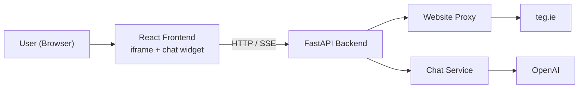

# TEG Chatbot

An AI-powered chatbot that answers questions based on website content. Built with React, FastAPI, RAG, Qdrant, and Deep Agents.

**Current status: Phase 1 — Direct LLM Chat**

---

## Architecture



### Phase 1 Data Flow

```
User types question
  → Frontend sends POST /api/chat/stream
  → Backend ChatService receives message + history
  → OpenAI streams tokens
  → Backend sends SSE events to frontend
  → Frontend displays streaming response
```

### Future Phases

RAG, Qdrant, crawling, and agents will be added in later phases. The current codebase is intentionally minimal for Phase 1.

---

## Project Structure

```
Teg Chatbot/
├── README.md
├── .gitignore
│
├── frontend/                    # React + TypeScript + Vite
│   ├── index.html
│   ├── src/
│   │   ├── App.tsx              # Site iframe + floating chat
│   │   ├── index.css            # Same styles as before
│   │   ├── components/
│   │   │   ├── SiteFrame/       # Proxied teg.ie iframe
│   │   │   └── chat/            # FloatingChat, ChatPanel, etc.
│   │   ├── hooks/useChat.ts
│   │   ├── services/api.ts
│   │   └── config/site.ts
│   └── package.json
│
└── backend/                     # Python + FastAPI
    ├── app/
    │   ├── main.py
    │   ├── config.py
    │   ├── api/
    │   │   ├── chat.py          # Health + streaming chat
    │   │   └── proxy.py         # teg.ie iframe proxy
    │   ├── models/chat.py
    │   └── services/
    │       ├── chat_service.py
    │       ├── proxy_service.py
    │       └── llm/             # OpenAI client + prompts
    ├── requirements.txt
    └── .env
```

### Why Each File Exists

| File | Purpose |
|------|---------|
| `config.py` | Centralizes all settings from `.env` — one place to configure everything |
| `services/llm/openai_provider.py` | OpenAI streaming chat client |
| `services/chat_service.py` | Business logic layer — later phases add RAG/agent calls here |
| `api/chat.py` | Thin route handlers — validates input, calls service, returns response |
| `hooks/useChat.ts` | Encapsulates chat state + streaming so components stay simple |
| `services/api.ts` | All HTTP calls in one file — easy to find and modify |

---

## Setup Instructions

### Prerequisites

- **Node.js** 18+ and npm
- **Python** 3.11+
- An [OpenAI](https://platform.openai.com/api-keys) API key

### 1. Clone and configure

```bash
cd "Teg Chatbot"
```

### 2. Backend setup

```bash
cd backend

# Create a virtual environment
python -m venv .venv

# Activate it
# Windows:
.venv\Scripts\activate
# macOS/Linux:
source .venv/bin/activate

# Install dependencies
pip install -r requirements.txt

# Edit backend/.env and set your OpenAI API key (OPENAI_API_KEY)
```

### 3. Frontend setup

Open a **second terminal**:

```bash
cd frontend
npm install
npm run dev
```

Open **http://localhost:5173** — teg.ie iframe + floating AI chatbot.

**Production build** (optional — single server):

```bash
cd frontend
npm run build
cd ../backend
uvicorn app.main:app --port 8000
```

Then open http://localhost:8000

---

## API Reference (Phase 1)

| Method | Endpoint | Description |
|--------|----------|-------------|
| `GET` | `/api/health` | Health check + active model info |
| `POST` | `/api/chat/stream` | Stream chat response via SSE |
| `GET/POST` | `/api/proxy/{path}` | Proxy teg.ie for iframe embedding |

### Request body (both chat endpoints)

```json
{
  "message": "What services do you offer?",
  "history": [
    { "role": "user", "content": "Hello" },
    { "role": "assistant", "content": "Hi! How can I help?" }
  ]
}
```

### Streaming response format (SSE)

```
data: {"content": "Hello"}
data: {"content": " there"}
data: {"done": true}
```

---

## OpenAI Configuration

Edit `backend/.env`:

```env
OPENAI_API_KEY=sk-your-key
OPENAI_MODEL=gpt-4o-mini
MAX_TOKENS=1024
TEMPERATURE=0.7
```

Restart the backend after changing.

---

## LangSmith tracing (optional)

Trace RAG retrieval (LangGraph) and OpenAI chat calls in [LangSmith](https://smith.langchain.com).

### 1. Configure

Add to `backend/.env`:

```env
LANGSMITH_TRACING=true
LANGSMITH_API_KEY=lsv2_pt_your-key
LANGSMITH_PROJECT=teg-chatbot
```

Restart the backend after saving.

### 2. Verify tracing is on

```bash
curl http://localhost:8000/api/health
```

Expected:

```json
{
  "status": "ok",
  "model": "gpt-4o-mini",
  "langsmith_tracing": true,
  "langsmith_project": "teg-chatbot"
}
```

### 3. Generate a trace

Send a chat message from the UI, or:

```bash
curl -N -X POST http://localhost:8000/api/chat/stream ^
  -H "Content-Type: application/json" ^
  -d "{\"message\": \"What is TEG?\", \"history\": []}"
```

(macOS/Linux: replace `^` line continuations with `\`.)

### 4. View in LangSmith

1. Open https://smith.langchain.com
2. Go to **Projects** → **teg-chatbot** (or your `LANGSMITH_PROJECT` name)
3. You should see runs such as:
   - **teg_chat** — full chat request
   - **teg_retrieval_graph** — LangGraph nodes (`detect_language`, `retrieve`, `format_context`)
   - **OpenAI** — streamed completion with token usage

Click a run to inspect inputs, outputs, latency, and nested spans.

### Disable tracing

Set `LANGSMITH_TRACING=false` or remove the LangSmith variables from `.env`, then restart.

---

## Phase 2: Website Crawler

Crawls **all internal HTML pages** on teg.ie using [Crawl4AI](https://github.com/unclecode/crawl4ai) (BFS deep crawl + sitemap seeding) and **extracts text from all linked PDFs**. PDF bytes are parsed in memory only — no files saved to disk.

```bash
cd backend
.venv\Scripts\activate
pip install -r requirements.txt
crawl4ai-setup          # installs Playwright browsers (first time only)
python scripts/crawl.py              # full crawl (~5-15 min)
python scripts/crawl.py --dry-run    # HTML crawl only, show counts
```

Output: `backend/data/crawled_content.json` (gitignored)

Each document includes `language` (`en` | `ga` | `mixed`) and `ingested_at`. The chatbot detects whether the user writes in Irish or English and responds in the same language.

---

## Development Tips

- **API docs**: http://localhost:8000/docs
- **Dev**: Backend on :8000, React on :5173 (Vite proxies `/api` to backend)
- **Prod**: `npm run build` then FastAPI serves `frontend/dist`
- **Website proxy**: `/api/proxy/` — required because teg.ie blocks direct iframe embedding

---

## Next Steps

Chunk `crawled_content.json`, embed, store in Qdrant, and wire RAG into the chat service.
