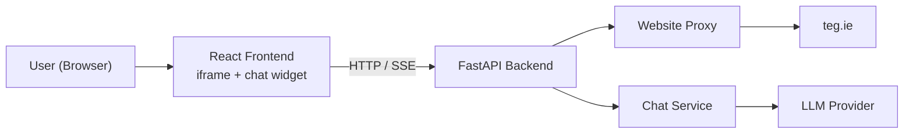

# TEG Chatbot

An AI-powered chatbot that answers questions based on website content. Built with React, FastAPI, RAG, Qdrant, and Deep Agents.

**Current status: Phase 1 — Direct LLM Chat**

---

## Architecture



### Phase 1 Data Flow

```
User types question
  → Frontend sends POST /api/chat/stream
  → Backend ChatService receives message + history
  → LLM Provider streams tokens
  → Backend sends SSE events to frontend
  → Frontend displays streaming response
```

### Future Phases

RAG, Qdrant, crawling, and agents will be added in later phases. The current codebase is intentionally minimal for Phase 1.

---

## Project Structure

```
Teg Chatbot/
├── README.md
├── .gitignore
│
├── frontend/                    # React + TypeScript + Vite
│   ├── index.html
│   ├── src/
│   │   ├── App.tsx              # Site iframe + floating chat
│   │   ├── index.css            # Same styles as before
│   │   ├── components/
│   │   │   ├── SiteFrame/       # Proxied teg.ie iframe
│   │   │   └── chat/            # FloatingChat, ChatPanel, etc.
│   │   ├── hooks/useChat.ts
│   │   ├── services/api.ts
│   │   └── config/site.ts
│   └── package.json
│
└── backend/                     # Python + FastAPI
    ├── app/
    │   ├── main.py
    │   ├── config.py
    │   ├── api/
    │   │   ├── chat.py          # Health + streaming chat
    │   │   └── proxy.py         # teg.ie iframe proxy
    │   ├── models/chat.py
    │   └── services/
    │       ├── chat_service.py
    │       ├── proxy_service.py
    │       └── llm/             # OpenAI + Gemini providers
    ├── requirements.txt
    └── .env.example
```

### Why Each File Exists

| File | Purpose |
|------|---------|
| `config.py` | Centralizes all settings from `.env` — one place to configure everything |
| `services/llm/base.py` | Defines the LLM interface so providers are swappable |
| `services/chat_service.py` | Business logic layer — later phases add RAG/agent calls here |
| `api/chat.py` | Thin route handlers — validates input, calls service, returns response |
| `hooks/useChat.ts` | Encapsulates chat state + streaming so components stay simple |
| `services/api.ts` | All HTTP calls in one file — easy to find and modify |

---

## Setup Instructions

### Prerequisites

- **Node.js** 18+ and npm
- **Python** 3.11+
- An API key from [OpenAI](https://platform.openai.com/api-keys) or [Google AI Studio](https://aistudio.google.com/apikey)

### 1. Clone and configure

```bash
cd "Teg Chatbot"
```

### 2. Backend setup

```bash
cd backend

# Create a virtual environment
python -m venv .venv

# Activate it
# Windows:
.venv\Scripts\activate
# macOS/Linux:
source .venv/bin/activate

# Install dependencies
pip install -r requirements.txt

# Create your environment file
copy .env.example .env        # Windows
# cp .env.example .env        # macOS/Linux

# Edit .env and add your API key:
#   LLM_PROVIDER=openai
#   OPENAI_API_KEY=sk-your-key-here
```

### 3. Frontend setup

Open a **second terminal**:

```bash
cd frontend
npm install
npm run dev
```

Open **http://localhost:5173** — teg.ie iframe + floating AI chatbot.

**Production build** (optional — single server):

```bash
cd frontend
npm run build
cd ../backend
uvicorn app.main:app --port 8000
```

Then open http://localhost:8000

---

## API Reference (Phase 1)

| Method | Endpoint | Description |
|--------|----------|-------------|
| `GET` | `/api/health` | Health check + active provider info |
| `POST` | `/api/chat/stream` | Stream chat response via SSE |
| `GET/POST` | `/api/proxy/{path}` | Proxy teg.ie for iframe embedding |

### Request body (both chat endpoints)

```json
{
  "message": "What services do you offer?",
  "history": [
    { "role": "user", "content": "Hello" },
    { "role": "assistant", "content": "Hi! How can I help?" }
  ]
}
```

### Streaming response format (SSE)

```
data: {"content": "Hello"}
data: {"content": " there"}
data: {"done": true}
```

---

## Switching LLM Providers

Edit `backend/.env`:

```env
# Use OpenAI (default)
LLM_PROVIDER=openai
OPENAI_API_KEY=sk-your-key
OPENAI_MODEL=gpt-4o-mini

# Or use Google Gemini
LLM_PROVIDER=gemini
GEMINI_API_KEY=your-gemini-key
GEMINI_MODEL=gemini-2.0-flash
```

Restart the backend after changing. No code changes needed.

---

## Development Tips

- **API docs**: http://localhost:8000/docs
- **Dev**: Backend on :8000, React on :5173 (Vite proxies `/api` to backend)
- **Prod**: `npm run build` then FastAPI serves `frontend/dist`
- **Website proxy**: `/api/proxy/` — required because teg.ie blocks direct iframe embedding
- **Adding a new LLM provider**: Create a class in `services/llm/`, implement `BaseLLMProvider`, register it in `get_llm_provider()`

---

## Next Steps

When ready for Phase 2, add crawling and RAG services under `backend/app/services/`.
